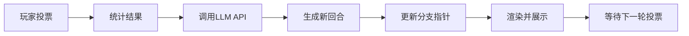

# 🎮 AI Game Master Bot

<div align="center">


**一个由AI驱动的互动叙事游戏平台，融合了Git版本控制的优雅设计**

[功能特性](#-功能特性) • [快速开始](#-快速开始) • [使用指南](#-使用指南) • [命令参考](#-命令参考) • [架构设计](#-架构设计)

</div>

---

## 📖 项目简介

AI Game Master Bot 是一个创新的互动叙事游戏插件，它将AI大语言模型（LLM）的创造力与Git版本控制的严谨性完美结合。玩家通过投票和自定义输入来推动剧情发展，AI GM则根据玩家的选择动态生成引人入胜的故事情节。

### 🎯 核心理念

- **AI驱动的叙事**：利用OpenAI GPT模型生成连贯、丰富的游戏剧情
- **Git式分支管理**：支持创建、切换和管理多个剧情分支
- **民主决策机制**：玩家通过表情投票共同决定故事走向
- **时间线管理**：可以回溯历史、创建平行世界、标记关键节点

---

## ✨ 功能特性

### 🤖 AI游戏主持
- 基于OpenAI GPT的动态剧情生成
- 智能上下文管理，保持故事连贯性
- 支持自定义系统提示词（System Prompt）
- 自动重试机制和速率限制处理

### 🌿 分支管理系统
- **创建分支**：从任意回合点创建新的剧情分支
- **切换分支**：在不同的故事线之间自由切换
- **合并策略**：保留所有历史，永不丢失任何剧情可能
- **可视化展示**：使用Graphviz生成直观的分支关系图

### 🗳️ 投票与交互
- **表情投票**：玩家使用表情符号对选项投票
- **自定义输入**：支持玩家提供自己的行动方案
- **实时统计**：动态统计投票结果
- **权限管理**：主持人和管理员拥有特殊控制权限

### 🏷️ 标签系统
- 标记重要的故事节点
- 快速跳转到关键剧情
- 查看标签相关的历史记录

### 📊 数据可视化
- **分支图**：清晰展示剧情树状结构
- **历史记录**：以时间线形式呈现故事发展
- **Markdown渲染**：将剧情渲染为精美图片
- **阅读时间估算**：自动计算预计阅读时长

### 🌐 Web界面
- 基于FastAPI的现代化Web UI
- 通过Cloudflare Tunnel实现公网访问
- 查看游戏状态、分支、标签等信息
- 浏览完整的剧情历史

---

## 🚀 快速开始

### 前置要求

- Python 3.11+
- SQLite 3
- Playwright（用于渲染）
- Graphviz（用于可视化）
- OpenAI API Key

### 安装步骤

1. **克隆项目**
```bash
git clone https://github.com/faithleysath/aigmbot.git
cd aigmbot
```

2. **安装依赖**
```bash
pip install -r requirements.txt
```

3. **安装Playwright浏览器**
```bash
playwright install chromium
```

4. **配置OpenAI API**

编辑配置文件，设置您的OpenAI API密钥：
```yaml
openai_api_key: "your-api-key-here"
openai_base_url: "https://api.openai.com/v1"
openai_model_name: "gpt-4-turbo"
```

5. **启动机器人**
```bash
python src/main.py
```

### Docker部署

```bash
# 构建镜像
docker build -t aigmbot .

# 运行容器
docker-compose up -d
```

---

## 📚 使用指南

### 创建游戏

1. **上传故事设定**：在群聊中上传一个 `.txt` 或 `.md` 文件作为游戏的系统提示词
2. **确认创建**：对机器人的预览消息点击 🎉 表情确认创建
3. **开始游戏**：AI GM将生成开场白并展示选项

### 投票与推进

- 对主消息的选项（A、B、C等）点击对应表情投票
- 主持人或管理员点击 🎉 确认推进到下一回合
- 点击 😰 否决当前投票结果
- 点击 ❌ 回退到上一回合

### 自定义输入

在回复主消息时@机器人，提供您自己的行动方案：
```
@AI_GM_Bot 我想尝试与龙谈判，提出和平共处的方案
```

其他玩家可以对您的提案投票（🎉赞成 / 😰反对）

### 分支管理

```bash
# 查看分支图
/aigm branch list

# 创建新分支（从当前回合）
/aigm branch create alternative-ending

# 切换到其他分支
/aigm checkout alternative-ending

# 查看分支历史
/aigm branch history main
```

---

## 🎮 命令参考

### 基础命令

| 命令 | 说明 |
|------|------|
| `/aigm help` | 显示帮助信息 |
| `/aigm status` | 查看当前游戏状态 |
| `/aigm webui` | 获取Web界面地址 |

### 分支操作

| 命令 | 说明 |
|------|------|
| `/aigm branch list [all]` | 显示分支图（all=完整图） |
| `/aigm branch show <name>` | 查看分支顶端内容 |
| `/aigm branch history <name> [limit]` | 查看分支历史 |
| `/aigm branch create <name> [round_id]` | 创建新分支 |
| `/aigm branch rename <old> <new>` | 重命名分支 |
| `/aigm branch delete <name>` | 删除分支 |

### 标签操作

| 命令 | 说明 |
|------|------|
| `/aigm tag list` | 列出所有标签 |
| `/aigm tag show <name>` | 查看标签指向的回合 |
| `/aigm tag create <name> [round_id]` | 创建新标签 |
| `/aigm tag delete <name>` | 删除标签 |

### 历史控制

| 命令 | 说明 |
|------|------|
| `/aigm checkout <branch>` | 切换分支 |
| `/aigm checkout head` | 重新加载最新状态 |
| `/aigm reset <round_id>` | 重置到指定回合 |
| `/aigm round show <id>` | 查看指定回合 |
| `/aigm round history <id> [limit]` | 查看回合历史 |

### 游戏管理

| 命令 | 说明 | 权限要求 |
|------|------|----------|
| `/aigm game list` | 列出所有游戏 | - |
| `/aigm game attach <id>` | 附加游戏到频道 | 主持人/管理员 |
| `/aigm game detach` | 从频道分离游戏 | 主持人/管理员 |
| `/aigm game sethost @user` | 变更游戏主持人 | 主持人/管理员 |

### 管理员命令

| 命令 | 说明 | 权限要求 |
|------|------|----------|
| `/aigm admin unfreeze` | 强制解冻游戏 | 管理员/ROOT |
| `/aigm admin delete <id>` | 删除游戏 | ROOT |

---

## 🏗️ 架构设计

### 技术栈

```
┌─────────────────────────────────────────┐
│          ncatbot Framework              │
├─────────────────────────────────────────┤
│  AI GM Plugin                           │
│  ├── Game Manager (游戏逻辑)           │
│  ├── Event Handler (事件处理)          │
│  ├── Command Handler (命令处理)        │
│  ├── LLM API (OpenAI集成)              │
│  ├── Database (SQLite + WAL)           │
│  ├── Cache Manager (缓存管理)          │
│  ├── Renderer (Markdown → 图片)        │
│  ├── Visualizer (分支图生成)           │
│  └── Web UI (FastAPI + Flare Tunnel)   │
└─────────────────────────────────────────┘
```

### 数据模型

```sql
-- 游戏表
games (game_id, channel_id, host_user_id, system_prompt, ...)

-- 分支表
branches (branch_id, game_id, name, tip_round_id, ...)

-- 回合表
rounds (round_id, game_id, parent_id, player_choice, assistant_response, ...)

-- 标签表
tags (tag_id, game_id, name, round_id, ...)
```

### 核心流程



### 特性亮点

- **异步架构**：全面使用 `async/await` 提高性能
- **事务安全**：支持嵌套事务和SAVEPOINT
- **并发控制**：游戏冻结机制防止竞态条件
- **智能缓存**：延迟保存策略，合并频繁的写操作
- **健壮性**：完善的错误处理和自动重试机制
- **可扩展性**：插件化设计，易于添加新功能

---

## ⚙️ 配置选项

### 必需配置

| 配置项 | 说明 | 默认值 |
|--------|------|--------|
| `openai_api_key` | OpenAI API密钥 | - |
| `openai_base_url` | API基础URL | `https://api.openai.com/v1` |
| `openai_model_name` | 使用的模型 | `gpt-4-turbo` |

### 可选配置

| 配置项 | 说明 | 默认值 |
|--------|------|--------|
| `openai_max_retries` | 最大重试次数 | `2` |
| `openai_base_delay` | 基础重试延迟（秒） | `1.0` |
| `openai_max_delay` | 最大重试延迟（秒） | `30.0` |
| `openai_timeout` | API调用超时（秒） | `60.0` |
| `pending_game_timeout` | 游戏确认超时（秒） | `300` |
| `max_concurrent_renders` | 最大并发渲染数 | `3` |

---

## 🎨 渲染效果

游戏剧情会被渲染为精美的图片，包含：
- **暗色主题**：护眼的深色背景
- **字数统计**：显示内容字数和预计阅读时间
- **Token计数**：显示LLM使用的Token数量
- **Markdown支持**：完整的Markdown格式渲染

---

## 🔒 安全性

- **权限分级**：ROOT用户、管理员、主持人、普通用户
- **操作验证**：关键操作需要权限检查
- **并发保护**：游戏冻结机制防止并发冲突
- **数据持久化**：使用WAL模式确保数据安全

---

## 🤝 贡献指南

我们欢迎所有形式的贡献！

1. Fork本项目
2. 创建您的特性分支 (`git checkout -b feature/AmazingFeature`)
3. 提交您的更改 (`git commit -m 'Add some AmazingFeature'`)
4. 推送到分支 (`git push origin feature/AmazingFeature`)
5. 开启一个Pull Request

### 开发建议

- 遵循代码风格（使用类型提示）
- 编写单元测试
- 更新文档
- 提交前运行测试

---

## 📝 更新日志

### v1.0.0 (2025-01-10)

- 🎉 首次发布
- ✨ 完整的AI GM功能
- 🌿 Git式分支管理
- 🗳️ 投票系统
- 🏷️ 标签系统
- 🌐 Web UI界面
- 📊 可视化工具

---

## 📄 许可证

本项目采用 MIT 许可证 - 详见 [LICENSE](LICENSE) 文件

---

## 🙏 致谢

- [ncatbot](https://github.com/...) - 机器人框架
- [OpenAI](https://openai.com/) - GPT模型
- [Playwright](https://playwright.dev/) - 浏览器自动化
- [Graphviz](https://graphviz.org/) - 图形可视化
- [FastAPI](https://fastapi.tiangolo.com/) - Web框架
- [Flaredantic](https://github.com/...) - Cloudflare Tunnel

---

## 📧 联系方式

- **作者**: Cline
- **GitHub**: [@faithleysath](https://github.com/faithleysath)
- **项目主页**: [aigmbot](https://github.com/faithleysath/aigmbot)

---

<div align="center">

**如果这个项目对您有帮助，请给它一个 ⭐️ Star！**

Made with ❤️ and 🤖

</div>
